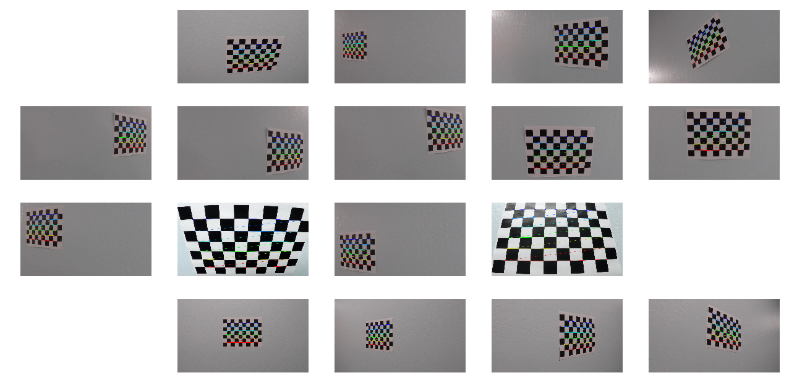
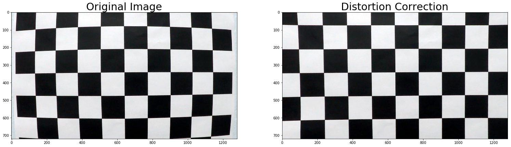
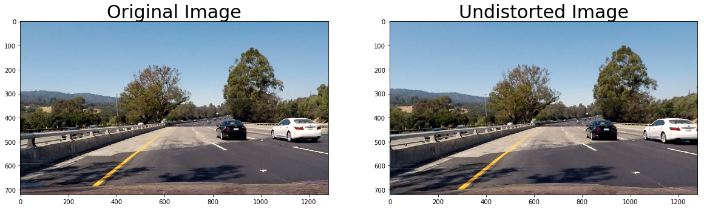
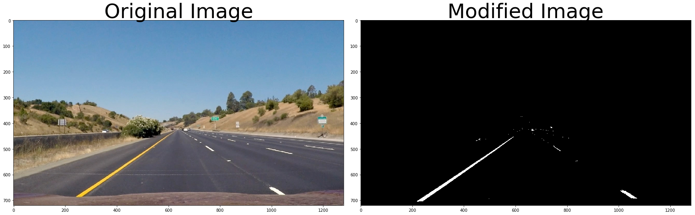
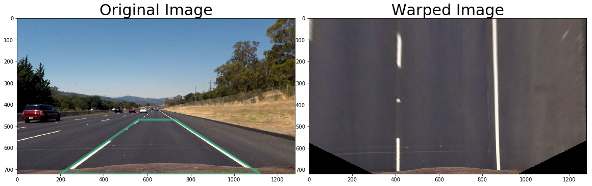
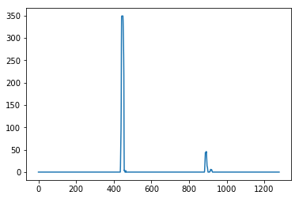
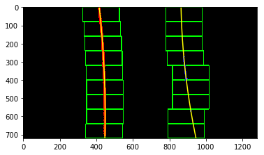
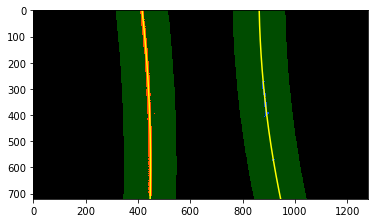
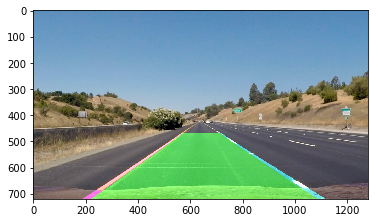
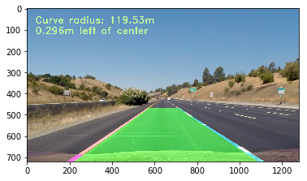

# Advanced Lane Finding Project

---

The goals / steps of this project are the following:

**Step 1**: Apply a distortion correction to raw images.

**Step 2**: Use color transforms and gradients to create a thresholded binary image.

**Step 3**: Apply a perspective transform to give us a "birds-eye view".

**Step 4**: Detect lane pixels and fit to find the lane boundary.

**Step 5**:  Determine the curvature of the lane and vehicle position with respect to center.

**Step 6**:  Warp the detected lane boundaries back onto the original image.

**Step 7**:  Output visual display of the lane boundaries and numerical estimation of lane curvature and vehicle position.

# Step 1:  Camera Distortion Correction

*Briefly state how you computed the camera matrix and distortion coefficients. Provide an example of a distortion corrected calibration image.*

As discussed in the class lectures, image distortion occurs as a camera captures 3D objects and transforms them into a 2D image.  Distortion changes how those objects appear.  This is important if we are wanting to take measurements from these images.  So the first step of the pipeline is to undo this distortion so we can take accurate measurements and calculations.

The project files included a number of calibration images that consisted of a checkerboard viewed from many different angles and orientations.  We leverage a few different built-in OpenCV functions to detect the corners of each checkerboard image.  We then use those corners with the calibrateCamera function which returns to us the camera matrix and distortion coefficients.  These values are then used to undistort later images taken from the same camera.

# Step 2:  Color Transforms and Gradients

*Describe how you used color transforms, gradients or other methods to create a thresholded binary image. Provide an example of a binary image result.*

Prior to adjusting the view's perspective, there are a number of transforms and adjustments we can make to the image that make detection easier later in the pipeline.  These three threshold functions are performed in sequence.  

The **Sobel Threshold** is a way of taking the absolute value of the Sobel Operator applied in the x and y directions.  This is like taking the gradient of the image.  The **Magnitude Threshold** allows us to target only those gradients that fit within our targeted threshold values.  The **Direcitonal Threshold** allows us to target lines that are oriented vertically, which is the likely orientation of the lane lines we are searching for.  

Each of these thresholds are done by creating a binary array that represents pixels that meet the threshold criteria.  

We can also explore making adjustments to our Red, Green, and Blue Channels, as well as our Hue, Saturation, and Lightness levels.  The result of appplying all of these threshold functions is the below output

# Step 3: Perspective Transform

Describe how you performed a perspective transform and provide an example of a transformed image.

To facilitate taking measurements for performing calculations, we must take them in the plane of the road. Because our 2D image is not in that orientation, we need to warp the image to give us the perspective needed. OpenCV gives us some handy functions to do just that. We can calculate a transformation matrix by inputing source points and destination points. We then use this transformation matrix in the warpPerspective function to get the orientation we need.

The below images show how this is done.  The green trapezoid drawn on the original image shows where the edges of the warped image are located.  

# Step 4:  Detect Lane Line Pixels

*Describe how you identified lane-line pixels and fit their positions with a polynomial?*

Now that we are looking at our image in the correct orientation we can start exploring and taking measurements.  We first start by taking a histogram of the non-zero pixels of the bottom of our image.  This gives us the starting point to further explore up the image to see if our lanes are curving left or right, or continuing straight.  We target the max values in our histogram.

Next we divide our image into distinct "windows."  This brackets our search area.  We identify the non-zero pixels in our search areas and then use numpy's polyfit function to fit a polynomial curve through our detected points.

Rather than starting from scratch on every image fed to us from a video, if we know where we we detected the lane lines previously, that can inform us on where to look in subsequent frames.  This increases our efficiency. 

# Step 5:  Radius of Curvature and Distance from Lane Center Calculation

*Describe how you calculated the radius of curvature of the lane and the position of the vehicle with respect to center.*

With the polynomial coefficients calculated, we can now calculate the curvature of the road and our distance from the center of the lane.  We apply some conversions of pixels to meters based on known actual lane line measurements.  We can then calculate where we are in relation to those lines by assuming that the center of the image represents the center of the car.  We then compute the middle of the lane lines as determined by where they intercept at the bottom of the image and compare them to our car center.  

 

# Step 6:  Draw the Detected Lane Back onto the Original Image

Now we can use these calculations to draw our detected lane lines and lane onto the image.

green lane image

# Step 7:  Add data to the image output

green lane with data image

# Video

Here is a link to the video showing how the pipeline performs on the provided video.  

---

# Discussion

*Briefly discuss any problems / issues you faced in your implementation of this project. Where will your pipeline likely fail? What could you do to make it more robust?  Discussion includes some consideration of problems/issues faced, what could be improved about their algorithm/pipeline, and what hypothetical cases would cause their pipeline to fail.*

The first challenge was adjusting the thresholds to output meaningful results.  Things like adjusting R and G values to help detect yellow lane lines, adjusting the S Channel for bring yellow and white, or L channel for dark pixels or shadows.  The shadows were also a difficult, and in the video the detected lane would be detected inconsistently when shadows would cast across the lanes.  Since these thresholds are currently static, I needed to set them so that they were universally applicable to the whole video.  Another challenge was when the lane detection was not consistent frame to frame.  In initial testing, the detected lane was very inconsistent and would change drastically frame to frame.  I added variables in the line class to retain information about the previous detected lanes and polynomial coefficients and applied an averaging strategy to detect and draw the lanes more consistently.  